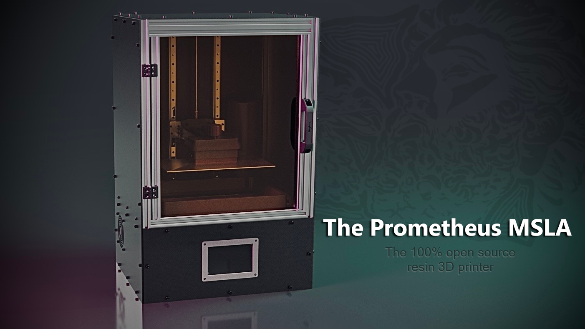

  <h1>Prometheus-MSLA</h1>

In greek mythology there is a legend of a Titan named Prometheus, he is known
for defying the gods by stealing fire and gifting it back to humanity.

Not only did he give them fire, Prometheus also taught humans how to use fire,
thus giving them the skill of metalwork, then ensued science and the arts,
allowing us to create everything we have today.

We created this project because we wanted to offer a machine that was accessible
to everyone, we wanted it to be easily modified so that you can create and give
your machine your own personal touch.

## Source and Documentation

### CAD
The full Prometheus Assembly can be viewed or downloaded over on
[GrabCAD](https://grabcad.com/library/the-prometheus-msla-v1-full-assembly-1)!

See [here](STL) for exported STLs of all of the printed parts, and
[here](Drawings) for the exported DXF files for the enclosure and base plates.

### Control Board
Prometheus Apollo Board EDA & Production Files Coming Soon!

### Firmware
For a fully configured Raspberry Pi image, check out
[PrometheusOS](https://github.com/TheContrappostoShop/PrometheusOS)!

You can also find our configuration files
[here](https://github.com/TheContrappostoShop/Prometheus_Config) for a manual
software install.

### Documentation
Finalized Build Guide Coming Soon!

In the mean-time, check out our
[Youtube Assembly Guide](https://www.youtube.com/watch?v=eP9PegG7pnA&list=PL1cx7A6ZVoZlWrnPsP4_g7WrTk8wNiGpT),
or join our Discord for advice and assistance!

## Community
If you want to share your experience or need more information, we are happy to
welcome you to our [Discord Server](https://discord.gg/GFUn9gwRsj).

## Licensing

This work is licensed under a <a rel="license" href="http://creativecommons.org/licenses/by-nc/4.0/">Creative Commons Attribution-NonCommercial 4.0 International License</a>.

## The Prometheus MSLA Team
|||
|-----|---|
| The Contrapposto Shop | Samuel (sam.boutin) and Melissa |
| CAD Modelling | Gil (rattus) and Shyam (eThing) |
| Electronics and Software | Paul (Paul_GD) and Ada (ragwafire) |
| The Rest of the Prometheus MSLA Team | Kristine (Elantris), Tyler, Stefan (Stuff!), Zakary, Zachary, Alain (Thewood3D) |

And thanks to all of those who helped, in one way or an other, on this open
source project!!
